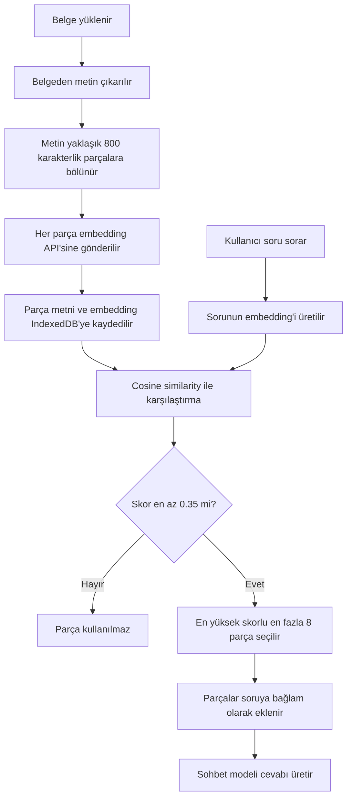

# Projedeki RAG Mimarisi

Bu belge, `chat-app.html` içindeki RAG (Retrieval-Augmented Generation / Getirim Destekli Üretim) sisteminin nasıl çalıştığını sade bir dille anlatır.

## Kısa özet

Bu projede RAG şu işi yapar:

1. Kullanıcının yüklediği belgeyi metne çevirir.
2. Metni küçük parçalara (`chunk`) böler.
3. Her parçanın anlamını temsil eden bir embedding üretir.
4. Parçaları ve embedding'leri tarayıcının IndexedDB veritabanında saklar.
5. Kullanıcı soru sorduğunda sorunun da embedding'ini üretir.
6. Soruyla anlam bakımından yeterince benzer belge parçalarını bulur.
7. Bulunan parçaları kullanıcı sorusunun yanına ekler.
8. Sohbet modeli, soruyu bu ek bilgilerle birlikte yanıtlar.

Sistem yalnızca aynı kelimeleri aramaz. Embedding servisi çalışıyorsa metinlerin anlam bakımından birbirine ne kadar yakın olduğuna bakar.

## Basit bir benzetme

RAG sistemini bir kütüphane görevlisi gibi düşünebiliriz:

- Embedding modeli kitabı cevaplamaz; yalnızca kitabın bölümlerini anlamlarına göre sınıflandırır.
- Kullanıcı bir soru sorunca embedding modeli sorunun hangi konuyla ilgili olduğunu belirler.
- Arama sistemi en alakalı bölümleri raftan çıkarır.
- Sohbet modeli bu bölümleri okuyarak son cevabı oluşturur.

Embedding modeli ile sohbet modeli bu nedenle iki farklı göreve sahiptir.

## Genel mimari



## Sistemin önemli ayarları

RAG ayarları `chat-app.html` içinde sabit olarak tanımlanmıştır:

| Ayar | Güncel değer | Anlamı |
|---|---:|---|
| `RAG_CHUNK_SIZE` | `800` | Bir belge parçasının hedef karakter uzunluğu |
| `RAG_CHUNK_OVERLAP` | `100` | Komşu parçalar arasında korunmaya çalışılan örtüşme |
| `RAG_MIN_SIMILARITY` | `0.35` | Anlamsal aramada kabul edilen minimum benzerlik skoru |
| `RAG_MAX_RESULTS` | `8` | Prompt'a eklenebilecek en fazla belge parçası |
| Embedding modeli | `text-embedding-3-small` | Metinleri sayısal anlam vektörlerine dönüştüren model |
| Veritabanı | `aiChat_RAG_v1` | Tarayıcıdaki IndexedDB veritabanının adı |

`8` değeri sistemin her soruda mutlaka sekiz parça kullanacağı anlamına gelmez. Yalnızca `0.35` eşiğini geçen parçalar kullanılır. İki uygun parça varsa iki parça, on uygun parça varsa en yüksek skorlu sekiz parça gönderilir.

## 1. Belge yükleme ve indeksleme

### 1.1. Belgeden metin çıkarılması

Kullanıcı Bilgi Tabanı ekranından bir dosya yüklediğinde `indexDocument()` fonksiyonu çalışır. Dosya türüne göre metin farklı şekilde çıkarılır:

- PDF dosyaları `pdfjsLib` ile okunur.
- DOCX dosyaları `mammoth` ile okunur.
- XLS ve XLSX dosyaları `XLSX` yardımıyla temiz metne çevrilir.
- CSV içeriği temizlenir.
- TXT, Markdown, JSON ve benzeri metin dosyaları doğrudan okunur.
- Eski `.doc` dosyalarında okunabilir karakterleri ayıklayan sınırlı bir yöntem kullanılır.

Dosya başına üst sınır 10 MB'dir. Dosyadan kullanılabilir metin çıkarılamazsa indeksleme durur.

### 1.2. Metnin parçalara bölünmesi

Çıkarılan metin doğrudan tek parça hâlinde embedding modeline gönderilmez. Önce `chunkText()` ile küçük parçalara ayrılır.

Sistem öncelikle paragraf sınırlarını kullanır. Hedef parça büyüklüğü yaklaşık 800 karakterdir. Önceki parçanın son bölümünden yaklaşık 100 karakterlik bir örtüşme hedeflenir. Bu örtüşme, bir cümlenin iki parça sınırında kopması durumunda anlam kaybını azaltır.

Çok büyük paragraflar ayrıca cümle sonlarından bölünmeye çalışılır.

Örnek:

```text
Uzun belge
   ├── Chunk 1: Giriş ve ilk konu
   ├── Chunk 2: İlk konunun sonu + ikinci konu
   ├── Chunk 3: İkinci konunun sonu + üçüncü konu
   └── Chunk 4: Sonuç
```

### 1.3. Embedding oluşturulması

Her chunk ayrı bir HTTP isteğiyle embedding API'sine gönderilir. Gövde şu yapıdadır:

```json
{
  "model": "text-embedding-3-small",
  "input": "Belgeden alınan chunk metni"
}
```

Buradaki `text-embedding-3-small` seçili sohbet modeli değildir. Kodda sabitlenmiş ayrı bir embedding modeli adıdır.

Örneğin kullanıcı sohbet için Qwen veya GPT-OSS seçmiş olsa bile embedding isteğinin `model` alanında yine `text-embedding-3-small` gönderilir. Ayarlanmış API sağlayıcısının hem `/embeddings` endpoint'ini hem de bu model adını desteklemesi gerekir.

### 1.4. Embedding URL'sinin oluşturulması

Uygulama embedding için ayrı bir URL ayarı istemez. Sohbet API URL'sinin sonunu otomatik değiştirir:

```text
/chat/completions  -> /embeddings
/responses         -> /embeddings
/completions       -> /embeddings
```

Örnek:

```text
Sohbet URL'si:    https://api.example.com/v1/chat/completions
Embedding URL'si: https://api.example.com/v1/embeddings
```

Sohbet isteğinde kullanılan header ve yetkilendirme bilgileri embedding isteğinde de kullanılır.

Önemli bir ayrıntı: Ayarlanan URL yukarıdaki üç kalıptan biriyle bitmiyorsa yol değişmeyebilir. Böyle bir durumda embedding isteği yanlış endpoint'e gidebilir.

### 1.5. Verilerin saklanması

Veriler uzak bir Pinecone, Qdrant, Weaviate veya PostgreSQL/pgvector sunucusunda tutulmaz. Tarayıcının yerel IndexedDB veritabanında saklanır.

İki kayıt grubu vardır:

#### `documents`

Belgenin genel bilgilerini saklar:

- Belge kimliği
- Dosya adı
- Dosya boyutu ve türü
- Chunk sayısı
- Embedding üretilebilen chunk sayısı
- Toplam karakter sayısı
- Oluşturulma zamanı

#### `chunks`

Her belge parçasını saklar:

- Chunk kimliği
- Ait olduğu belge kimliği
- Belgedeki sıra numarası
- Chunk'ın asıl metni
- Chunk embedding'i

Bu yaklaşım kurulumu kolaylaştırır; ancak veriler yalnızca aynı tarayıcı profili ve aynı site kaynağında kullanılabilir. Tarayıcı verileri temizlenirse bilgi tabanı da silinebilir.

## 2. Kullanıcı soru sorduğunda gerçekleşen arama

### 2.1. Sorunun embedding'i oluşturulur

RAG aktifse kullanıcının yazdığı soru `getEmbedding()` fonksiyonuna gönderilir. Belge parçalarında kullanılan modelle aynı model adı kullanılır:

```json
{
  "model": "text-embedding-3-small",
  "input": "Kullanıcının sorusu"
}
```

Belge ve soru aynı embedding uzayında temsil edildiği için birbirleriyle karşılaştırılabilir.

### 2.2. Cosine similarity hesaplanır

Sistem sorunun embedding'i ile veritabanındaki her chunk embedding'ini karşılaştırır. Bunun için cosine similarity kullanılır.

Basit anlamıyla cosine similarity iki metnin anlam yönlerinin ne kadar benzer olduğunu ölçer:

- `1.00` değerine yaklaştıkça benzerlik çok yüksektir.
- Değer küçüldükçe ilişki zayıflar.
- Bu projede `0.35` altındaki sonuçlar kullanılmaz.

Örnek sonuçlar:

| Chunk | Örnek skor | Sonuç |
|---|---:|---|
| İade prosedürü | `0.82` | Kullanılır |
| Ödeme iptali | `0.67` | Kullanılır |
| Teslimat bilgisi | `0.31` | Eşik altında olduğu için kullanılmaz |
| Personel izinleri | `0.08` | Kullanılmaz |

Gerçek skorlar kullanılan embedding modeline ve metne göre değişir. `0.35`, bu proje için başlangıç eşiğidir; evrensel ve her veri kümesi için kusursuz bir değer değildir.

### 2.3. Skor eşiği ve sonuç sınırı uygulanır

`rankSemanticChunks()` şu sırayla çalışır:

1. Embedding'i olmayan chunk'ları çıkarır.
2. Her chunk için cosine similarity skorunu hesaplar.
3. Skoru `0.35` altında olanları çıkarır.
4. Kalanları en yüksek skordan en düşük skora sıralar.
5. En fazla 8 sonucu bırakır.

Bu yöntem, önceki “skoru ne olursa olsun ilk 5 sonucu getir” davranışına göre daha güvenlidir. Alakasız sonuçların sırf listeyi doldurmak için prompt'a eklenmesini önler.

## 3. Embedding çalışmazsa kelime araması

Kullanıcı sorusunun embedding isteği başarısız olursa sistem tamamen durmaz. `searchRAG()` basit kelime eşleşmesine geçer.

Bu yedek yöntemde:

1. Soru Türkçe küçük harfe çevrilir.
2. Üç karakterden uzun kelimeler alınır.
3. Bu kelimelerin her chunk içinde kaç kez geçtiği sayılır.
4. En çok eşleşen en fazla 8 chunk seçilir.

Örneğin kullanıcı “ödeme iadesi” yazarsa bu iki ifadenin geçtiği parçalar öne çıkar. Ancak “paramı geri almak istiyorum” şeklindeki anlamsal olarak benzer fakat farklı kelimeler içeren bir soru aynı başarıyla bulunamayabilir.

Bu nedenle:

- Embedding başarılıysa anlamsal arama yapılır.
- Soru embedding'i üretilemezse kelime tabanlı yedek arama yapılır.

Önemli mevcut davranış: Belge yüklenirken bir chunk'ın embedding isteği başarısız olursa hata sessizce yakalanır ve chunk `embedding: null` olarak kaydedilir. Bilgi Tabanı ekranındaki `embedded/toplam` göstergesi bu nedenle kontrol edilmelidir. Örneğin `8/8 embedded` başarılı, `0/8 embedded` başarısız anlamına gelir.

## 4. Bulunan bağlamın sohbet modeline verilmesi

Arama sonuçları aşağıdakine benzer bir metne dönüştürülür:

```text
--- Bilgi Tabanından Bulunan Bağlam ---
[Kaynak 1: iade-politikasi.pdf]
İade talebi satın alma tarihinden itibaren...

---

[Kaynak 2: odeme-kosullari.docx]
Ödeme iptali için kullanıcı...
--- Bağlam Sonu ---

Yukarıdaki bağlamı kullanarak kullanıcı sorusunu yanıtla.
```

Bu metin, kullanıcının görünen mesajı değiştirilmeden API'ye giden metnin sonuna eklenir. Ardından normal sohbet modeli cevabı üretir.

Bu aşamada görev dağılımı şöyledir:

| Bileşen | Görevi |
|---|---|
| Embedding modeli | Metinleri anlam vektörlerine dönüştürmek |
| Cosine similarity | Soru ile chunk'ların yakınlığını hesaplamak |
| RAG kodu | Uygun chunk'ları seçip prompt'a eklemek |
| Sohbet modeli | Soru ve bulunan bağlamdan son cevabı yazmak |

## 5. Baştan sona örnek

`sirket-politikasi.pdf` içinde şu cümle olduğunu düşünelim:

```text
Çalışanlar kullanılmayan yıllık izinlerini sonraki takvim yılına devredebilir.
```

Kullanıcı ise şöyle sorsun:

```text
Kalan tatil günlerim gelecek seneye aktarılır mı?
```

Kelime eşleşmesi zayıftır; belgede “tatil günü” veya “gelecek sene” ifadeleri birebir bulunmayabilir. Buna rağmen embedding modeli şu anlam ilişkilerini yakalayabilir:

- tatil günü ≈ yıllık izin
- gelecek sene ≈ sonraki takvim yılı
- aktarmak ≈ devretmek

İlgili chunk'ın skoru `0.35` eşiğini geçerse prompt'a eklenir. Sohbet modeli de belge bilgisini kullanarak yanıt verir.

## 6. Veri nerede işleniyor?

Mimari tamamen yerel değildir:

- Dosyadan metin çıkarma tarayıcıda yapılır.
- Chunk'lar ve embedding'ler tarayıcıdaki IndexedDB'de saklanır.
- Embedding üretmek için belge metinleri yapılandırılmış API sağlayıcısına gönderilir.
- Arama ve cosine similarity hesabı tarayıcıda yapılır.
- Seçilen chunk metinleri, cevap oluşturması için sohbet API'sine gönderilir.

Bu nedenle hassas belgeler kullanılırken hem embedding sağlayıcısının hem de sohbet modeli sağlayıcısının veri politikaları dikkate alınmalıdır.

## 7. Mevcut mimarinin güçlü yanları

- Kurulum için ayrı bir vektör veritabanı gerektirmez.
- Veritabanı ve benzerlik hesabı doğrudan tarayıcıda çalışır.
- PDF, DOCX, Excel, CSV ve metin dosyalarını destekler.
- Kelime eşleşmesi yerine anlamsal arama yapabilir.
- Minimum skor eşiği alakasız bağlamı azaltır.
- En fazla 8 sonuç sınırı prompt'ın kontrolsüz büyümesini önler.
- Embedding servisi tamamen çalışmazsa kelime aramasıyla temel işlev devam eder.

## 8. Mevcut sınırlamalar

### Sabit embedding modeli

Embedding model adı `text-embedding-3-small` olarak kodda sabittir. Sohbet modeli veya API sağlayıcısı değiştirildiğinde embedding modeli otomatik uyarlanmaz.

### Ayrı embedding URL ayarı yok

Embedding URL'si sohbet URL'sinden türetilir. Bazı sağlayıcılar sohbet ve embedding modellerini farklı sunucularda veya farklı URL yapılarında sunabilir.

### Doğrusal arama

Her soruda IndexedDB'deki bütün chunk'lar okunup tek tek karşılaştırılır. Küçük ve orta büyüklükteki bilgi tabanları için basittir; binlerce veya on binlerce chunk olduğunda yavaşlayabilir.

### Embedding üretimi toplu değil

Belge yüklenirken chunk'lar tek tek embedding API'sine gönderilir. Büyük belgelerde bu durum çok sayıda HTTP isteği ve daha uzun indeksleme süresi oluşturabilir.

### Hatalar yeterince görünür değil

Belge chunk'ının embedding isteği başarısız olduğunda hata sessizce geçilir. Kullanıcı yalnızca `embedded/toplam` sayısından problemi anlayabilir.

### Kaynak gösterimi garanti değil

Kaynak adı prompt'a eklenir, ancak sohbet modelinin cevabında kaynak göstermesi teknik olarak zorunlu tutulmaz.

### Skor eşiği ölçülerek seçilmedi

`0.35` makul bir başlangıç değeridir. En iyi değer, projede gerçekten sorulacak sorular ve doğru cevapların bulunduğu chunk'lar kullanılarak test edilmelidir.

## 9. Sorun giderme

### Belge kartında `0/N embedded` görünüyorsa

Tarayıcı geliştirici araçlarında `Network` sekmesi açılarak `/embeddings` isteği kontrol edilmelidir:

- `200`: İstek başarılıdır; yanıtta embedding dizisi bulunmalıdır.
- `400 model not found`: Sağlayıcı `text-embedding-3-small` modelini tanımıyor olabilir.
- `401` veya `403`: API anahtarı ya da yetki problemi vardır.
- `404`: Sağlayıcıda `/embeddings` endpoint'i olmayabilir veya URL yanlış türetilmiştir.
- CORS hatası: Sunucu tarayıcıdan gelen isteğe izin vermiyordur.

### RAG açık ama bağlam bulunamıyorsa

Şunlar kontrol edilmelidir:

1. Belge gerçekten indekslenmiş mi?
2. Belge kartındaki embedded sayısı sıfırdan büyük mü?
3. Soru ile belge parçasının skoru `0.35` eşiğini geçiyor mu?
4. API sağlayıcısı embedding modelini destekliyor mu?
5. Tarayıcıdaki IndexedDB verileri temizlenmiş olabilir mi?

## 10. Kod haritası

Ana uygulama dosyası: [`chat-app.html`](./chat-app.html)

| Bölüm | Fonksiyon veya sabit |
|---|---|
| Temel RAG ayarları | `RAG_CHUNK_SIZE`, `RAG_CHUNK_OVERLAP`, `RAG_MAX_RESULTS`, `RAG_MIN_SIMILARITY` |
| IndexedDB açma | `openRAGDB()` |
| Metni parçalama | `chunkText()` |
| Embedding URL'si | `getEmbeddingUrl()` |
| Embedding isteği | `getEmbedding()` |
| Benzerlik hesabı | `cosineSim()` |
| Skor filtreleme ve sıralama | `rankSemanticChunks()` |
| Belge indeksleme | `indexDocument()` |
| RAG araması | `searchRAG()` |
| Prompt'a bağlam ekleme | `augmentWithRAG()` |
| Mesaj gönderimine entegrasyon | `sendMessage()` içindeki `augmentWithRAG()` çağrısı |

## Sonuç

Projedeki RAG sistemi, tarayıcı içinde çalışan hafif bir anlamsal arama mimarisidir. Belgeler küçük parçalara ayrılır, parçaların embedding'leri API aracılığıyla üretilir ve IndexedDB'de saklanır. Kullanıcının sorusu ile belge parçaları cosine similarity kullanılarak karşılaştırılır. En az `0.35` skor alan en fazla 8 parça sohbet modelinin bağlamına eklenir.

Kısacası sistemin temel mantığı şudur:

> Belgenin tamamını modele göndermek yerine, soruyla anlam bakımından ilgili bölümleri bul ve yalnızca bu bölümleri cevap modeline ver.

