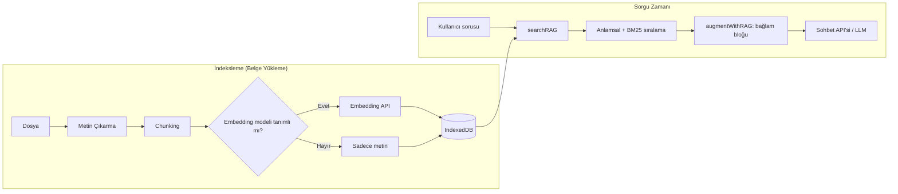
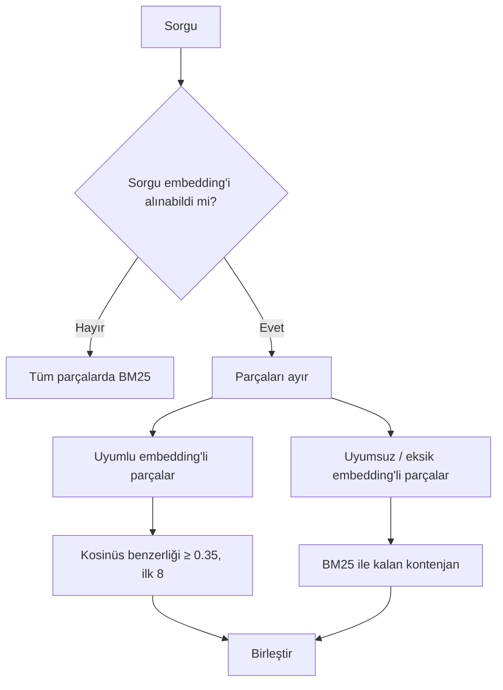

# 🧠 RAG (Retrieval-Augmented Generation) Mimarisi

Bu doküman, [chat-app.html](chat-app.html) içindeki Bilgi Tabanı (RAG) yapısını açıklar. Tüm RAG motoru **tarayıcıda çalışır**; ayrı bir sunucu, vektör veritabanı veya backend gerekmez. Kod, dosyadaki `14.6 RAG MOTORU` bölümünde yer alır.

---

## 1. Genel Bakış

Kullanıcı belgelerini (PDF, Word, Excel, metin vb.) yükler; sistem bunları parçalara böler, isteğe bağlı olarak her parça için **embedding (vektör)** üretir ve **IndexedDB**'ye kaydeder. Kullanıcı soru sorduğunda en ilgili parçalar bulunur ve soruya **bağlam olarak eklenerek** LLM'e gönderilir.



---

## 2. Sabitler ve Ayarlar

| Sabit | Değer | Anlamı |
| :--- | :--- | :--- |
| `RAG_DB_NAME` | `aiChat_RAG_v1` | IndexedDB veritabanı adı |
| `RAG_DB_VERSION` | `1` | Şema sürümü |
| `RAG_CHUNK_SIZE` | `800` | Hedef parça uzunluğu (karakter) |
| `RAG_CHUNK_OVERLAP` | `100` | Parçalar arası örtüşme (karakter, yaklaşık) |
| `RAG_MAX_RESULTS` | `8` | Sorguda döndürülecek en fazla parça |
| `RAG_MIN_SIMILARITY` | `0.35` | Anlamsal aramada minimum kosinüs benzerliği |
| `LS_RAG_KEY` | `aiChat.ragEnabled.v1` | RAG aç/kapa durumu (`localStorage`) |

Ek sınırlar:
- Dosya boyutu en fazla **10 MB**.
- Embedding'e giden metin en fazla **8000 karakter** (`text.slice(0, 8000)`).

---

## 3. Veri Depolama (IndexedDB)

`openRAGDB()` iki object store oluşturur:

### `documents` (keyPath: `id`)
| Alan | Açıklama |
| :--- | :--- |
| `id` | `doc-<zaman>-<rastgele>` |
| `name`, `size`, `type` | Dosya adı, boyutu, uzantısı |
| `chunkCount` | Toplam parça sayısı |
| `embeddedCount` | Embedding'i alınmış parça sayısı |
| `totalChars` | Çıkarılan toplam karakter |
| `createdAt` / `updatedAt` | Zaman damgaları |

### `chunks` (keyPath: `id`, index: `docId`)
| Alan | Açıklama |
| :--- | :--- |
| `id` | `<docId>-c<sıra>` |
| `docId`, `index` | Ait olduğu belge ve sırası |
| `text` | Parça metni |
| `embedding` | Vektör (`number[]`) veya `null` |
| `embeddingProfile` | Modelin + (hassas bilgiden arındırılmış) URL'nin JSON özeti |
| `embeddingModel`, `embeddingDimensions` | Model adı ve vektör boyutu |

> [!NOTE]
> `embeddingProfile`, URL içindeki `key`, `token`, `secret` gibi parametreler ve kullanıcı/parola bilgisi silinerek oluşturulur; yani API anahtarları profile yazılmaz.

---

## 4. İndeksleme Hattı

Fonksiyonlar: `handleKBUpload` → `indexDocumentWithConfig`

### 4.1 Metin çıkarma

| Format | Yöntem |
| :--- | :--- |
| `.pdf` | **pdf.js** — sayfa sayfa `getTextContent()`, sayfalar `\n\n` ile birleşir |
| `.docx` | **mammoth.js** — `extractRawText` |
| `.doc` | Binary içinden okunabilir ASCII dizileri (≥4 karakter) ayıklanır; başarısızsa `.docx` olarak kaydetme önerilir |
| `.xlsx/.xls` | **SheetJS** — `parseExcelToCleanText` ile temiz metin/CSV |
| `.csv` | `cleanCsvText` |
| Diğer metin/kod dosyaları | `file.text()`; 3+ boş satır sadeleştirilir |

Metin çıkarılamazsa `Dosyadan metin çıkarılamadı.` hatası verilir.

### 4.2 Chunking (`chunkText`)

1. Metin **paragraflara** (`\n\s*\n`) bölünür.
2. Paragraflar, toplam uzunluk 800 karakteri aşana kadar birleştirilir.
3. Sınır aşıldığında mevcut parça kaydedilir; yeni parça, önceki parçanın **son ~20 kelimesi** (`overlap / 5`) ile başlar (örtüşme, bağlam kopmasını önler).
4. Hâlâ `size × 1.5` (1200) karakterden büyük parçalar **cümle sınırlarından** (`. ! ?`) tekrar bölünür.

### 4.3 Embedding üretimi

- Embedding modeli **tanımlıysa** her parça için `getEmbedding()` çağrılır; ilerleme `Embedding 3/42` gibi gösterilir.
- Tanımlı **değilse** (`resolveEmbeddingConfigForIndexing()` → `null`) belge yalnızca metin olarak kaydedilir ve **anahtar kelime araması** kullanılır.
- Tek bir parçanın embedding'i başarısız olursa belge **iptal edilmez**; metin korunur, eksik sayı arayüzde gösterilir ve sonradan yeniden indekslenebilir.
- Vektör boyutu işlem sırasında değişirse hata sayılır (tutarlılık koruması).
- Geçerli vektör: sonlu sayılardan oluşan, boş olmayan ve tamamı sıfır olmayan dizi (`isEmbeddingVector`).

### 4.4 Eşzamanlılık kilidi

`runRAGIndexing` aynı anda yalnızca **bir** indeksleme/yeniden indeksleme işlemine izin verir. İşlem sürerken dosya seçici devre dışı kalır, belge silme engellenir.

---

## 5. Embedding Yapılandırması

`getEmbeddingSettings()` / `resolveEmbeddingConfig()`:

| Ayar | Açıklama |
| :--- | :--- |
| `model` | Embedding model adı (boşsa embedding yok → keyword modu) |
| `useChatApi` | `true` (varsayılan): sohbet URL'sinden endpoint türetilir |
| `url` | Ayrı embedding URL'si (`useChatApi=false` iken) |
| `apiKey` | `Authorization: Bearer ...` olarak eklenir (ayrı URL modunda) |
| `headers` | Ek header'lar (JSON nesnesi); `Content-Type` her zaman `application/json` |

**Endpoint türetme (`useChatApi=true`):**

| Sohbet URL'si biter | Embedding URL'si |
| :--- | :--- |
| `/chat/completions`, `/responses`, `/completions` | `/embeddings` |
| `/embeddings` | olduğu gibi |
| `/v1` | `/v1/embeddings` |
| boş path | `/v1/embeddings` |
| diğer | Hata: ayrı URL tanımlanmalı |

İstek: `POST { "model": "...", "input": "<metin>" }`
Yanıt: `data[0].embedding` veya `embedding` alanı okunur (OpenAI uyumlu).

---

## 6. Arama (Retrieval) — `searchRAG`

Hibrit bir strateji uygulanır:



### 6.1 Anlamsal arama
- `cosineSim(a, b)` ile sorgu vektörü ile parça vektörleri karşılaştırılır.
- Yalnızca **uyumlu** parçalar dahil edilir: aynı `embeddingProfile`, aynı boyut, geçerli vektör (`isEmbeddingCompatible`).
- `score ≥ 0.35` olanlar azalan sırada alınır, en fazla 8 sonuç.

### 6.2 Anahtar kelime (BM25) araması
`rankKeywordChunks`:
- Küçük harfe çevirme `tr-TR` yerel ayarıyla yapılır.
- Kelime ayrıştırma: Unicode harf/rakam (`[\p{L}\p{N}]+`), 2 karakterden kısa kelimeler atılır.
- **Basit Türkçe kök kırpma:** 4 karakterden uzun kelimeler ilk 4 harfe indirilir (ör. `bankalar` → `bank`).
- **BM25** puanlaması: `k1 = 1.5`, `b = 0.75`; IDF ve ortalama uzunluk tüm korpus üzerinden hesaplanır.

### 6.3 Yedekleme (fallback) davranışı
- Sorgu embedding'i alınamazsa (model yok, ağ hatası vb.) tüm parçalar BM25 ile aranır; hata kullanıcıya yansıtılmaz.
- Embedding'i uyumsuz/eksik parçalar, anlamsal sonuçlardan arta kalan kontenjanı BM25 ile doldurur.
- Kullanıcı isteği iptal ettiyse (`AbortSignal`) hata yukarı fırlatılır.

Dönüş değeri: `[{ text, docName, score }]`

---

## 7. Sohbete Entegrasyon — `augmentWithRAG`

`sendMessage` içinde, **RAG anahtarı açıksa** (`ragEnabled`):

1. Kullanıcının **görünür metni** ile `searchRAG` çağrılır.
2. Sonuç yoksa bağlam eklenmez.
3. Sonuçlar şu biçimde API'ye giden metnin sonuna eklenir:

```text
<kullanıcı sorusu>

--- Bilgi Tabanından Bulunan Bağlam ---
[Kaynak 1: dosya.pdf]
<parça metni>

---

[Kaynak 2: rapor.docx]
<parça metni>
--- Bağlam Sonu ---

Yukarıdaki bağlamı kullanarak kullanıcı sorusunu yanıtla.
```

Önemli noktalar:
- Bağlam, mesajın `apiContent` alanına yazılır; ekranda kullanıcıya **sadece yazdığı soru** (`content`) gösterilir.
- Şablon (prompt template) seçiliyse, bağlam şablon metninden sonra `Kullanıcı bağlamı:` altında yer alır.
- RAG aramasındaki herhangi bir hata sohbeti bozmaz; bağlamsız devam edilir (`console.warn`).
- Gönderim süresince arayüz kilitlenir (`setBusy(true)`); sohbet değişirse mesaj gönderilmez.

---

## 8. Yeniden İndeksleme ve Uyumluluk Durumu

Embedding modeli veya URL değiştiğinde eski vektörler yeni modelle **uyumsuz** olur.

`getRAGIndexStatus` her belge için sayar:

| Durum | Anlamı |
| :--- | :--- |
| `compatible` | Güncel modelle uyumlu vektör |
| `missing` | Hiç embedding'i olmayan parça |
| `incompatible` | Farklı profil/boyutta embedding'e sahip parça |
| `needsReindex` | `compatible < total` |

`reindexRAGDocuments` tüm parçaların embedding'ini güncel modelle yeniden üretir. Metinler yeniden okunmaz/parçalanmaz; yalnızca vektörler güncellenir. Başarısız parçalar atlanır ve sayılır. Arayüzde uyumsuz belgeler *"Yeniden indeksleme gerekli"* uyarısıyla gösterilir.

---

## 9. Kullanıcı Arayüzü

- **Bilgi Tabanı butonu** (`kbBtn`): Bilgi Tabanı modalını açar.
- **Modal:** sürükle-bırak / tıkla yükleme alanı, belge listesi (parça sayısı, boyut, hazır/eksik/uyumsuz sayıları), silme butonu.
- **RAG anahtarı** (`ragToggle`): Durum `localStorage`'da saklanır; ayarlar dışa/içe aktarımına (`ragEnabled`) dahildir.
- **Ayarlar paneli:** Embedding model, URL, API anahtarı ve header alanları ile "Bilgi tabanı uyumu" göstergesi.

---

## 10. Özet Tablosu

| Konu | Karar |
| :--- | :--- |
| Çalışma yeri | Tamamen istemci tarafı (tarayıcı) |
| Depolama | IndexedDB (`documents`, `chunks`) |
| Parçalama | Paragraf tabanlı, 800 karakter, ~100 karakter örtüşme, cümle bazlı ikincil bölme |
| Vektör benzerliği | Kosinüs, eşik 0.35 |
| Metinsel arama | BM25 + Türkçe kök kırpma (4 harf) |
| Sonuç sayısı | En fazla 8 parça |
| Embedding yoksa | Anahtar kelime moduna düşer |
| Hata toleransı | Kısmi embedding hatası belgeyi bozmaz; arama hatası sohbeti bozmaz |
| Sınırlar | 10 MB/dosya, 8000 karakter/embedding girdisi |

## 11. Bilinen Sınırlamalar

- Ayrı bir vektör indeksi (ANN) yoktur; arama tüm parçalar üzerinde doğrusal tarama yapar. Çok büyük bilgi tabanlarında yavaşlayabilir.
- Arama sorgusu yalnızca son kullanıcı mesajıdır; önceki sohbet geçmişi sorguya katılmaz.
- `.doc` desteği basit bir ASCII ayıklamadır, kalitesi sınırlıdır.
- Türkçe kök kırpma basit (ilk 4 harf) olduğundan morfolojik olarak kesin değildir.
- Parçalar için yeniden sıralama (reranking) uygulanmaz.
